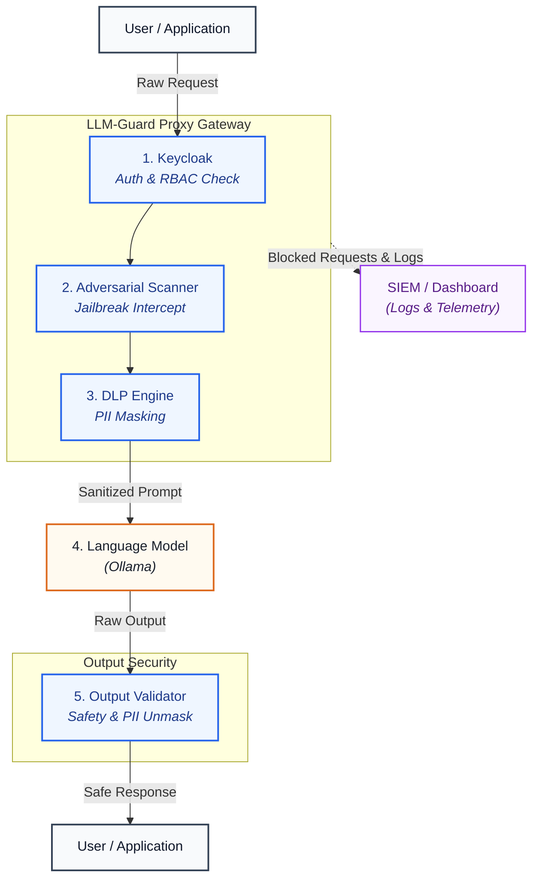
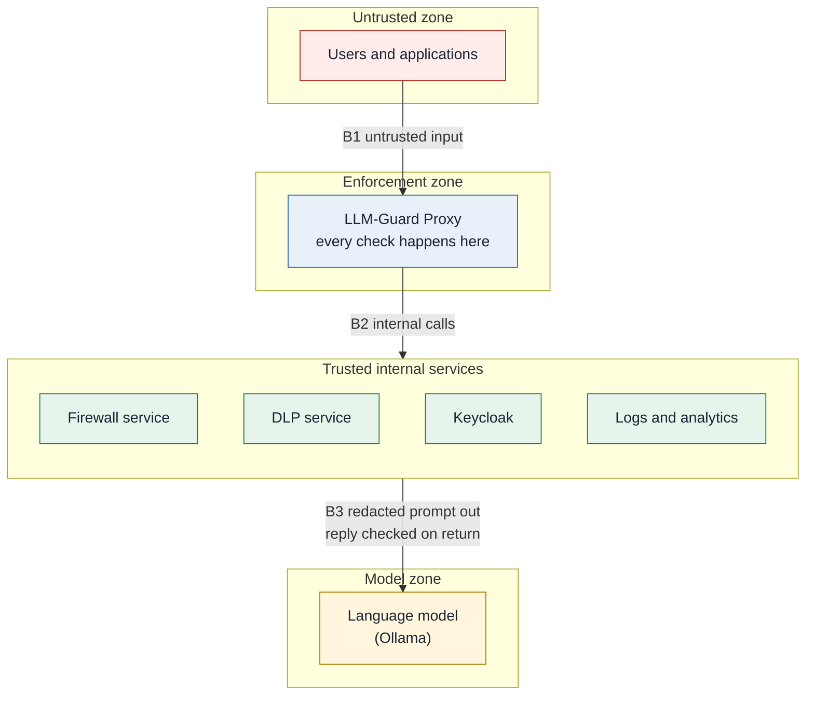

# LLM-Guard Architecture

> See also: [Setup Guide](setup.md) · [Security Documentation](security.md)

## 1. Architecture Overview

LLM-Guard is a reverse proxy placed between an application and a large language model. Each chat request passes through a sequence of security checks before it reaches the model. Each model reply passes through a second sequence of checks before it reaches the user. Requests that fail a check are stopped, and each stop is recorded as a structured event that a security team can review.

The proxy accepts the OpenAI style `/v1/chat/completions` format, so an existing application only needs its model address changed. In this project the upstream model is served locally by Ollama.

The design rests on four principles.

| Principle | How it is applied |
|---|---|
| Enforce at one point | All traffic to the model goes through the proxy, so every control sits in a single path |
| Fail closed | If a required security service cannot answer, the request or reply is refused |
| Minimise exposure | Sensitive values are replaced with tokens before the model sees them |
| Leave a record | Every block produces an event with the user, the layer, and the rule |

## 2. System Architecture

LLM-Guard sits between the user and the language model. A request is checked on the way in, and the answer is checked on the way back. Anything that fails a check is stopped and recorded for the security team.

How a request flows:

1. The application sends the user's message to the proxy with a login token.
2. The proxy checks who the user is, then checks the prompt for attacks.
3. Sensitive values such as emails and card numbers are hidden, and the safe prompt goes to the language model.
4. The answer is checked for harmful content and leaked data, the hidden values are restored, and the answer goes back to the user.
5. If any check fails, the request stops, the user gets an error with a reason, and an event appears on the dashboard.

## 3. Core Components

| Component | Technology | Port | Responsibility |
|---|---|---|---|
| Proxy | Go | 8080 | Receives requests, runs the check chain, routes to the model, writes telemetry |
| Firewall service | Python, FastAPI | 5001 | Scores prompts for jailbreak and injection likelihood and holds the tunable thresholds |
| DLP service | Python, FastAPI, Presidio | 9100 | Finds sensitive values, replaces them with tokens, and restores them |
| Analytics sidecar | Python, FastAPI, SQLite | 9200 | Stores events, serves metrics, and serves the dashboard |
| Keycloak | Docker image | 8081 | Authenticates users and issues signed tokens that carry the role |
| Ollama | External runtime | 11434 | Runs the language models |

### 3.1 Proxy modules

The proxy source is in `proxy/internal`. Each package implements one stage of the chain.

| Package | Purpose |
|---|---|
| `middleware` | Defines the chain. Request hooks run before the model call and response hooks after it |
| `rbac` | Verifies the token signature, issuer, client, and expiry, maps the role, and enforces model and length limits |
| `rules` | Length limit, text normalisation, pattern blocklist, and the call to the Firewall service |
| `threatdetect` | HTTP client for the Firewall service |
| `dlp` | HTTP client for the DLP service, used for redaction and unmasking |
| `hardening` | Adds a defensive instruction to the system prompt |
| `outputguard` | Blocks toxic replies and replies that leak sensitive data, and flags hallucination signals |
| `telemetry` | Writes blocked events to a log file and sends them to the sidecar |
| `proxy` | HTTP server, model routing, and premium model fallback |
| `config` | Loads `config.yaml` |

### 3.2 Firewall service

The classifier is a scikit-learn pipeline. It combines word features (one and two word sequences) and character features (three to five characters) and passes them to a logistic regression model. It is trained from `services/data/jailbreak_dataset.csv` and saved as `services/artifacts/jailbreak_model.joblib`. If the model file is missing, the service trains one at first start.

Two thresholds decide the result.

| Score | Result |
|---|---|
| Below 0.45 | Allowed |
| 0.45 to below 0.60 | Blocked and marked for review |
| 0.60 and above | Blocked |

Both values can be changed at runtime with `GET` and `POST /v1/firewall/config` and are saved to `services/artifacts/thresholds.json`.

### 3.3 DLP service

Detection uses Presidio with the spaCy model `en_core_web_md`. It recognises email addresses, credit card numbers, US social security numbers, and API keys. API keys are matched with custom patterns for OpenAI style keys and AWS access keys, plus a lower confidence pattern for long token like strings.

Each match is replaced with a token such as `[EMAIL_ADDRESS_3fa9c1d2]`. The mapping from token to original value is returned to the proxy and kept in memory for that one request. The DLP service stores nothing.

### 3.4 Analytics sidecar

The sidecar accepts events at `/api/v1/telemetry/ingest` and stores them in `audit_logs.db`. It exposes `/api/v1/telemetry/events` and `/api/v1/telemetry/metrics` and serves the security console at `/dashboard`.

### 3.5 Access control

Users and roles are managed in Keycloak. The proxy never handles passwords. It downloads the public signing keys from Keycloak and verifies each token itself, so it does not call Keycloak on every request.

| Role | Models | Maximum prompt length |
|---|---|---|
| admin | default and premium | 4000 characters |
| employee | default and premium | 4000 characters |
| guest | default only | 1000 characters |

The limits come from the `rbac` section of `config.yaml`. The user ID recorded in telemetry is taken from the verified token.

### 3.6 Telemetry

When any stage blocks a request, the proxy builds one event. The event contains the timestamp, event ID, user ID, client address, deciding layer (`rbac`, `rules`, or `outputguard`), prompt length, status code, reason, triggering rule, classifier score, and a prompt sample of at most 200 characters. The event is appended to `logs/telemetry_events.jsonl` as one JSON object per line and is posted to the sidecar. The file is written first, and a failure to reach the sidecar is logged without changing the response to the user.

Two further logs exist. `logs/rules_decisions.jsonl` records the rules stage outcome for every request. `logs/outputguard_flags.jsonl` records hallucination flags on replies that were delivered.

## 4. Technology Stack

| Area | Technology |
|---|---|
| Proxy | Go 1.21 or later, standard library HTTP server |
| Services | Python 3.10 or later, FastAPI, Uvicorn, Pydantic |
| Threat detection | scikit-learn (TF-IDF features, logistic regression), joblib |
| Data loss prevention | Presidio Analyzer and Anonymizer, spaCy |
| Identity | Keycloak, OpenID Connect, RS256 signed tokens |
| Storage | SQLite for analytics, JSON lines files for logs |
| Model serving | Ollama with Llama 3.2 3B and Llama 3.1 8B |
| Dashboard | HTML, CSS, and JavaScript served by the sidecar |
| Testing | Go test, pytest, PowerShell test runner |

## 5. Security and Trust Boundaries

The system is split into four zones. Input from the untrusted zone is never passed on until the proxy has checked it, and the model is never trusted to produce a safe answer without a check. The full threat model and the known limits are in [`security.md`](security.md).

| Boundary | What crosses it | What protects it |
|---|---|---|
| B1 | User requests entering the proxy | Token and role checks, length limit, attack rules, classifier, and removal of sensitive data |
| B2 | Proxy calls to the Firewall service, the DLP service, Keycloak, and the logs | Calls carry prompt text only. If a required service does not answer, the request is refused |
| B3 | Prompt going to the model and the answer coming back | The prompt is redacted and hardened, the answer length is capped, and the answer is checked before it reaches the user |