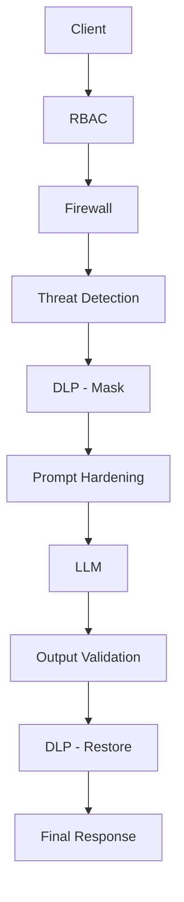

<div align="center">

# 🛡️ LLM-Guard

**Generative AI Prompt Firewall**

[](https://go.dev/)
[](https://www.python.org/)
[](https://fastapi.tiangolo.com/)
[](https://www.keycloak.org/)

</div>

---

## Overview

- **LLM-Guard** is a reverse proxy that sits directly in front of a locally-served LLM and enforces
  authentication, threat detection, data loss prevention, and output validation on every request and
  response, with no change required on the model-serving side.
- **The issue:** once an LLM is wired into an application or internal system, it becomes a new attack
  surface. Prompt injection, jailbreaking, and adversarial inputs can manipulate a model into ignoring
  its instructions or disclosing data it was never meant to return, and conventional security tooling
  isn't built to parse natural language, so none of it catches this.
- **Why it matters:** because of this gap, LLM-Guard enforces at a single point in front of the model —
  authenticating the caller, scoring prompts for jailbreak intent, masking sensitive data, and checking
  the model's own reply — and blocks and logs anything that fails a check instead of letting it through.

## Features

- Token-based authentication and per-role access control (RBAC) via Keycloak/OIDC
- Deterministic prompt rules: length limits and pattern blocklist, with Unicode normalization against obfuscated input
- ML-based jailbreak classification with tunable sensitivity thresholds
- Data loss prevention: detects and masks sensitive values before they reach the model, restores them on the way back
- Prompt hardening against instruction-override and injection attempts
- Output validation: toxicity checks, output data-leak re-scan, hallucination-signal flagging
- Structured audit logging with a live security console

## Architecture



RBAC gates every other stage — an unauthenticated or unauthorized request never reaches the
firewall, the model, or any downstream check. Telemetry is not part of the sequential pipeline;
every enforcement point reports its decision to it independently. Each stage is documented fully
in [`Architecture`](LLM-guard\documentation\Architecture.md).

## Dashboard

The analytics sidecar serves a single-page security console at `/dashboard`, covering:

- Blocked requests over time, severity mix, and breakdowns by guardrail layer and by rule
- Users with the most blocks, and the latest events as they happen
- Jailbreak score distribution and the firewall rules most frequently triggered
- Access-control (RBAC) denials and output-guard rule triggers

## Project Structure

Full setup, including prerequisites, dependency installation, and the run sequence across all
services, is documented in [`Setup`](LLM-guard\documentation\Setup.md).

```
LLM-guard/
├── proxy/                    # Go reverse proxy
│   ├── cmd/proxy/             # entry point
│   └── internal/
│       ├── proxy/             # HTTP server, model routing
│       ├── middleware/        # hook chain definition
│       ├── rbac/              # token verification, role and model gating
│       ├── rules/              # length check, blocklist, normalization
│       ├── threatdetect/      # client for the jailbreak classifier
│       ├── dlp/                # client for the DLP service
│       ├── hardening/         # system-prompt defense
│       ├── outputguard/       # output toxicity, leak, and hallucination checks
│       ├── telemetry/         # audit log writer and sidecar forwarder
│       └── config/             # configuration loading
├── dlp-service/               # Presidio-based PII masking service
├── services/firewall/         # jailbreak classifier service
├── sidecar/analytics/         # audit store and dashboard
├── tests/                     # test runner and verification scripts
└── documentation/             # design docs
```

## Documentation

- [`Architecture`](LLM-guard\documentation\Architecture.md): system design, components, and trust boundaries
- [`Setup`](LLM-guard\documentation\Setup.md): installation, configuration, running, and testing
- [`Security`](LLM-guard\documentation\Security.md): security controls, authentication, and threat handling

## License

 
This project is **proprietary** and not open source. It was developed as part of the
**Axlero Solutions Internship Program**. All rights are reserved